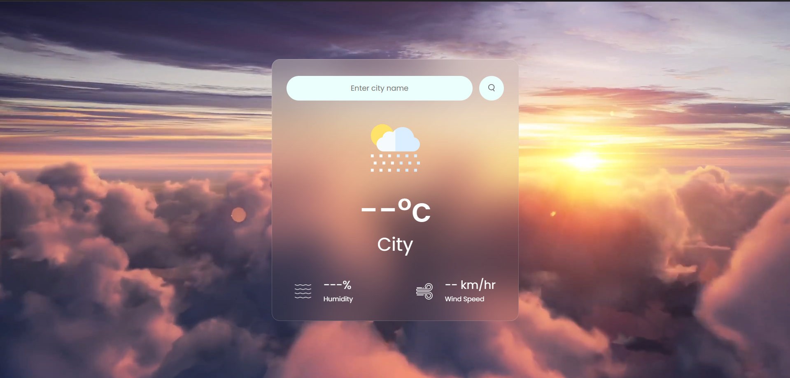

# Weather App

A simple and responsive Weather application built using HTML, CSS, and JavaScript.

## [View Live](https://weather-app-pathan.netlify.app/)

## Overview

This project is a weather application that allows users to search for the current weather conditions in any city. It provides a user-friendly interface with dynamic background videos that change based on the weather conditions. The app is designed to be visually appealing and easy to navigate.

## Preview

## Features

- Search for weather by city name.
- Displays current temperature, humidity, and wind speed.
- Dynamic background video that changes based on weather conditions.
- Responsive design that works on various devices.

## Screenshot

## Technical Details

- **HTML**: Used for structuring the weather app layout and elements.
- **CSS**: Used for styling the app interface and ensuring responsiveness.
- **JavaScript**: Used for fetching weather data from the OpenWeatherMap API and handling user input.

## License

This project is licensed under the MIT License. See `LICENSE` for details.

## Contributing

Contributions are welcome! If you'd like to contribute to this project, please fork the repository and submit a pull request.

## Acknowledgments

- Weather data provided by [OpenWeatherMap](https://openweathermap.org/).
- Font: Poppins, courtesy of Google Fonts.